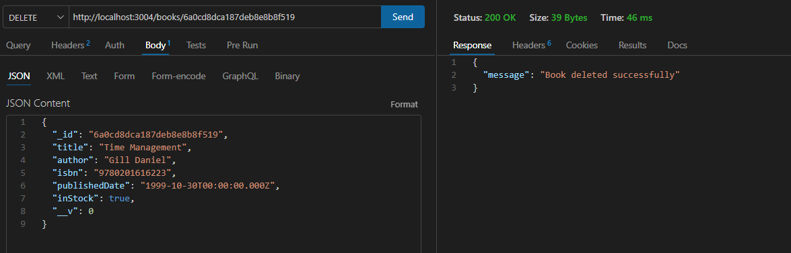

Mongoose MongoDB API Working model

This project I have created a Mongoose schema to define the shape of my json response. The database connection is made to mongoDB via the express server (thro the local machine port); The files are 

